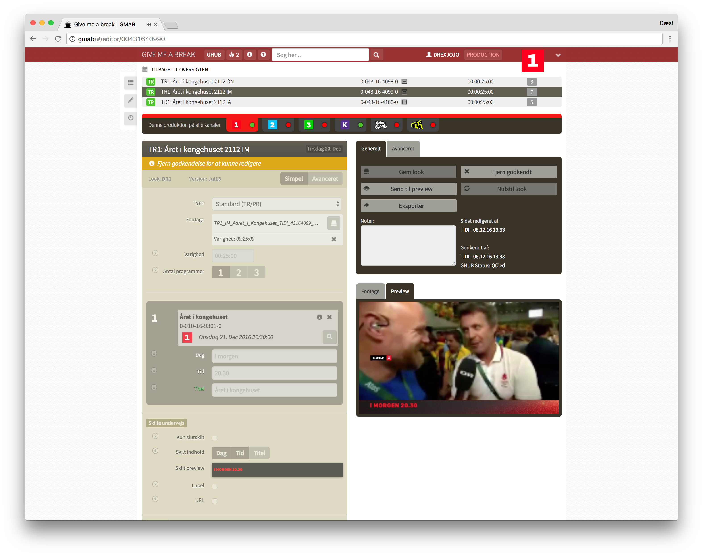

import Vimeo from "../../components/vimeo.js";

export const metadata = {
  date: "2016-01-28T18:18:56-05:00",
  title: "DR Airlook",
  client: "Danish Broadcasting Corporation",
  category: "broadcast",
};

Worked over a long period from 2013 on a large project at the [Danish Broadcast - DR](http://dr.dk) on creating a new system for handling all video clips in between the programs, also known as the Airlook.

The task was to come up with a system where the advanced ideas the DR Design department had for the new designs on the 6 TV channels could work in an automated broadcast world. It turned out that no broadcast systems could handle it, so we had to create it from bottom up.

Together with [Johan Bichel](http://johan.cc) and Martin Bollerup, we created a new system using our own render farm of After Effects machines that automatically rendered the video clips using custom programmed templates.

Here are a couple of the airlooks we implemented.

DR Ramasjang (for small children)

<Vimeo videoId="90229333" />

DR2 (news)

<Vimeo videoId="63398483" />

DR K (culture)

<Vimeo videoId="68133093" />

DR Ultra (for older children)

<Vimeo videoId="68201881" />

We also created a site where marketing could specify all the variables, and get them rendered automatically.

