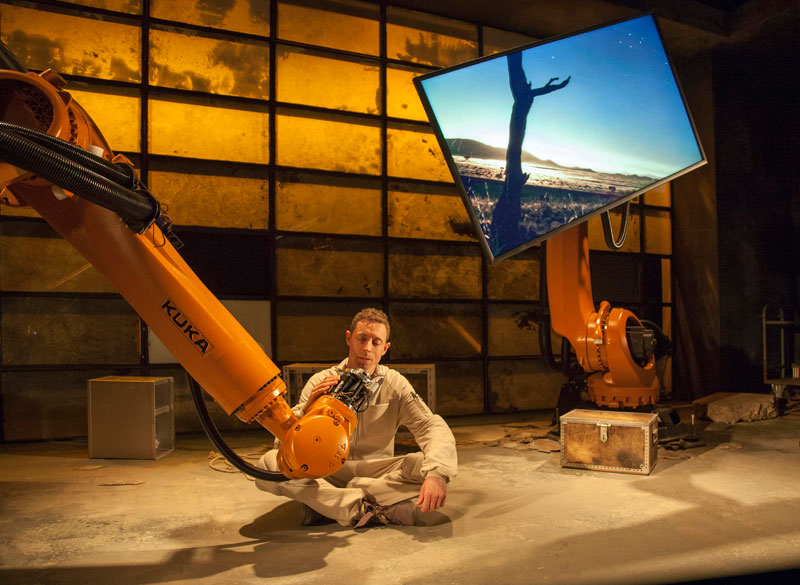

import Vimeo from "../../components/vimeo.js";

export const metadata = {
  date: "2014-03-29",
  title: "Fremtiden",
  client: "Flyvende Grise",
  category: "theatre",
};

Theatre production by [Flyvende Grise](https://vimeo.com/flyvendegrise) using two large Kuka industrials robots on stage. I was asked to be in charge of robot programming, and went to Sweden to get a Kuka Robot Certificate.

Photo by Bjarne Stehr

<Vimeo videoId="89607669" />

<Vimeo videoId="87583697" />

<Vimeo videoId="88094580" />
