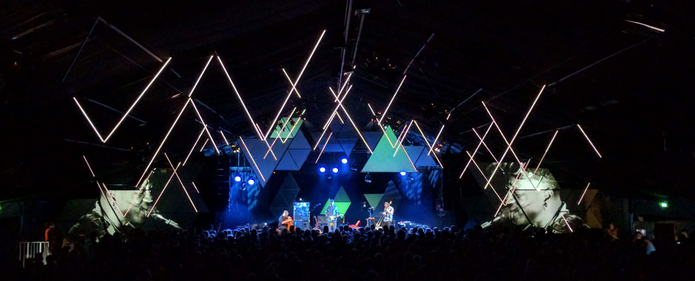
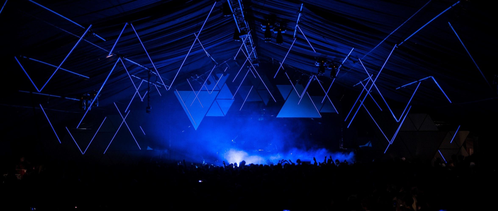
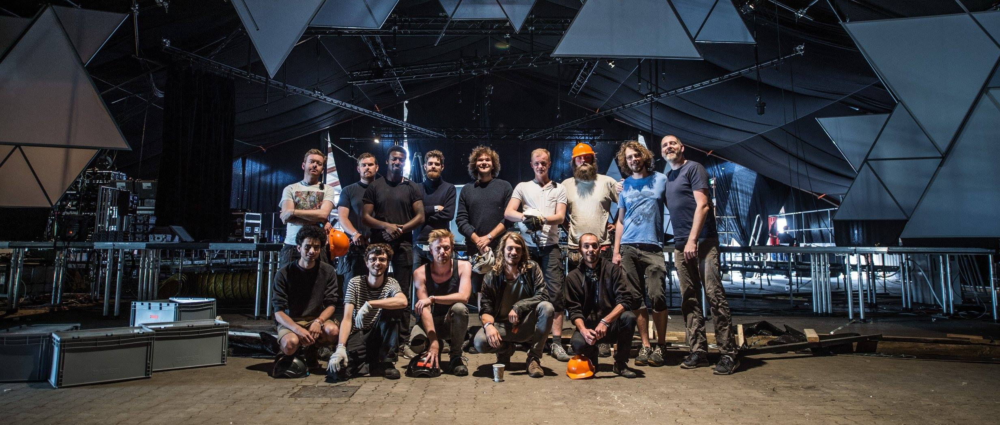
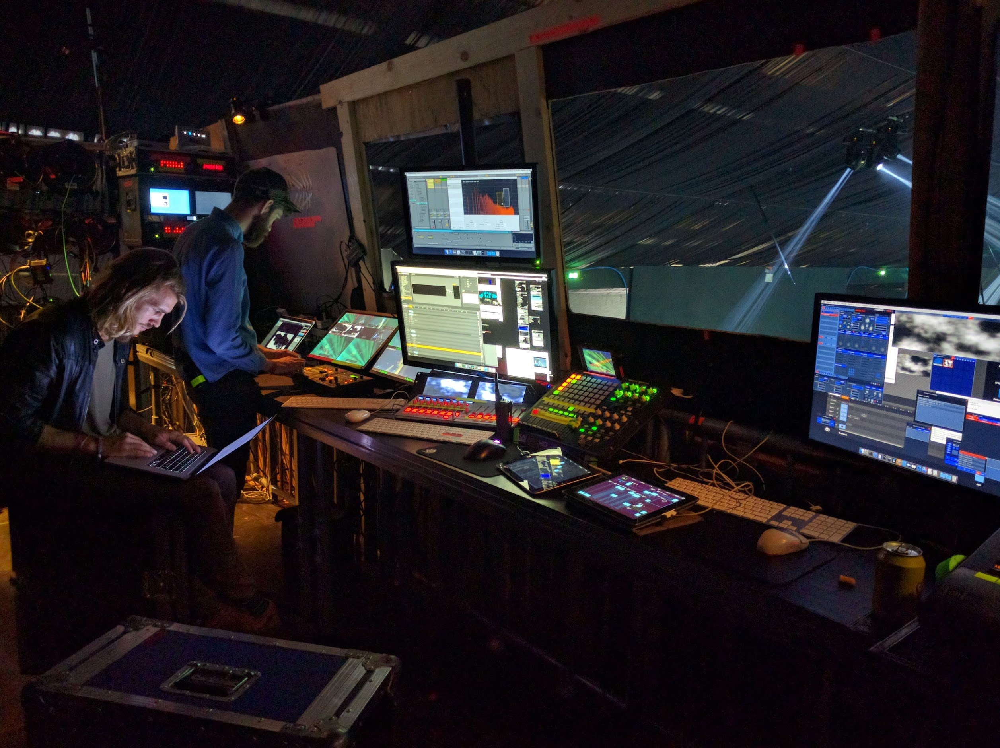
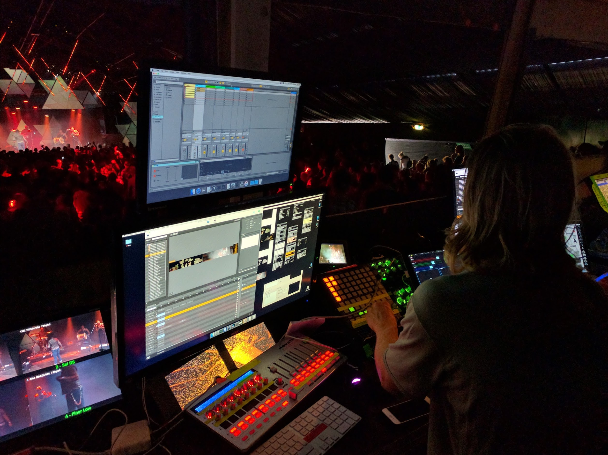
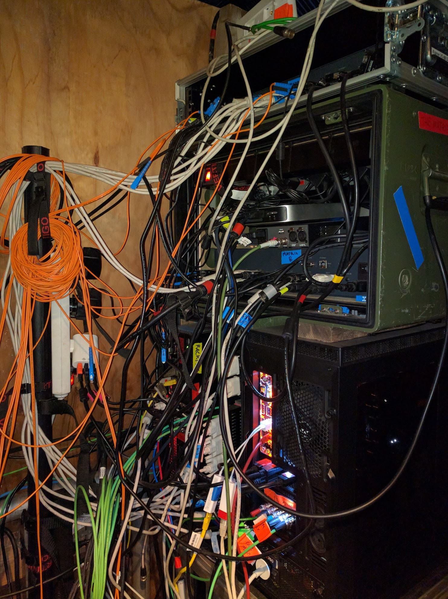

export const metadata = {
  date: "2016-07-01",
  title: "Roskilde Festival Gloria Stage",
  client: "Obscura",
  category: "installation",
};

Since 2013 I have been part of the visuals team by [Obscura](http://obscura.dk/) for the Gloria Stage on the annual Roskilde Festival. Gloria Stage is the smallest venue (capacity is about 1200) at the festival, that hosts more than 100,000 guests every year. On our stage we get all the small, weird and surprising bands; last year we hosted more than 25 bands over 4 days.

The stage is our annual playground for pushing the boundaries of projection mapping, and live graphics. We use a large custom setup consisting of several Hackintoshes connected, and a combination of openFrameworks apps and class VJ software all composed in [Millumin](http://www.millumin.com/).

We are a team of 14 setting up all the visuals and lighting on the stage in a couple of days, and running all the concerts.

