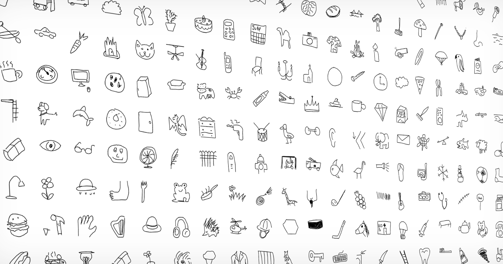

export const metadata = {
  date: "2017-05-18",
  title: "Quick, Draw! Dataset",
  client: "Google Creative Lab",
  category: "web",
};

The Quick Draw Dataset is a collection of 50 million drawings from the [Quick, Draw!](/work/quick-draw) game. I created a site visualizing the data in collaboration with [Ian Johnson](http://enjalot.github.io/), [Kyle McDonald](http://www.kylemcdonald.net/), [David Ha](https://twitter.com/hardmaru) and colleagues from the Google Creative Lab.

You can visit the site visualizing the 50 million drawings [here](https://quickdraw.withgoogle.com/data), or go to our [github](https://github.com/googlecreativelab/quickdraw-dataset) to download the data.
