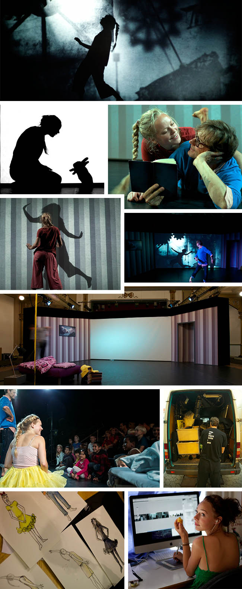

import Vimeo from "../../components/vimeo.js";
export const metadata = {
  date: "2011-08-28",
  title: "Se Min Skygge",
  client: "ZeBU",
  category: "theatre",
};

<Vimeo videoId="35282102" />

Childrens performance about a girl that follows her own shadow into the shadow world. In collaboration with graphic designer Siri Carlslund, we created a visual storyboard for the performance and created all the worlds of shadows she entered in the performance.

The graphics were double projected from front and back to in order to create layered shadow play (where the shadow could get behind and in front of video we projected). I also had two kinects to manipulate her real shadow, and delay it, and to make the worlds react to her position. It was all packed in a van and is able to be put up in 3 hours at schools.

Source code: [Github](https://github.com/HalfdanJ/HalfdanJ/tree/master/Se%20Min%20Skygge)

