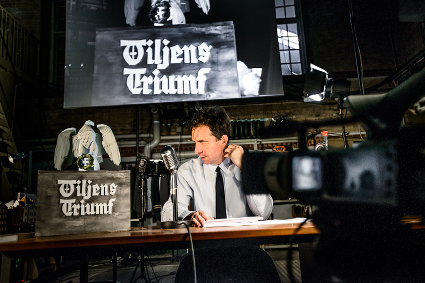
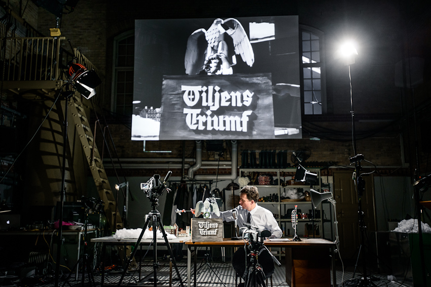
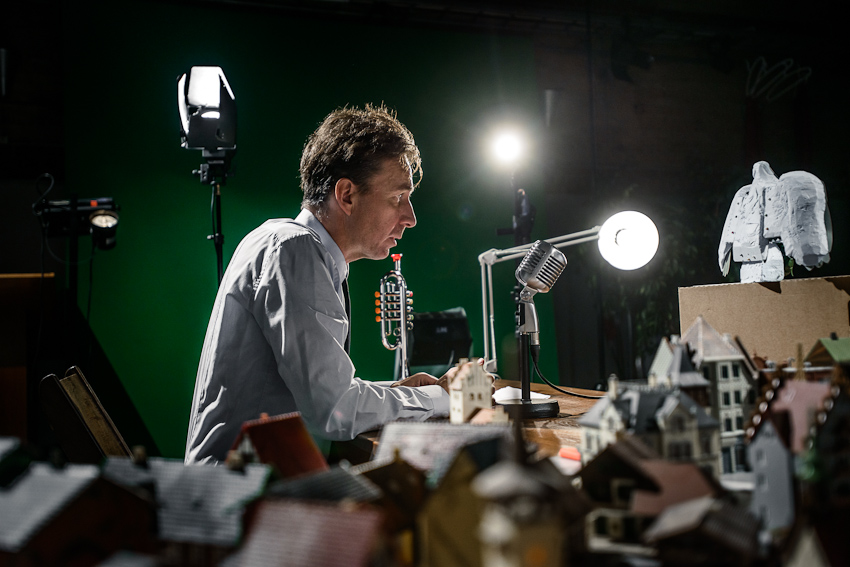
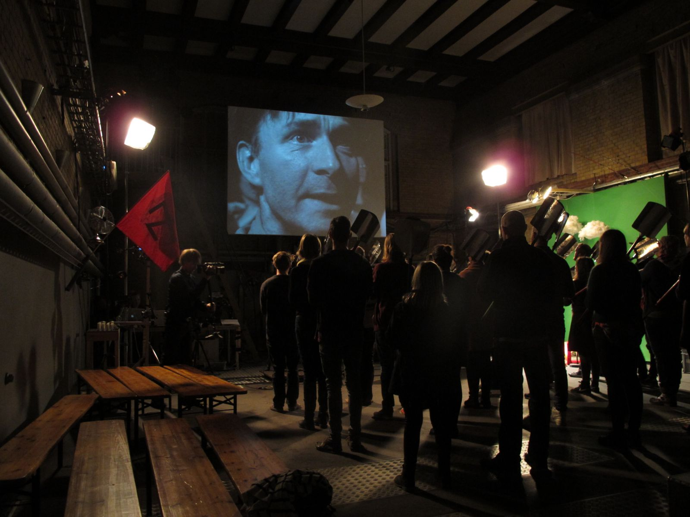
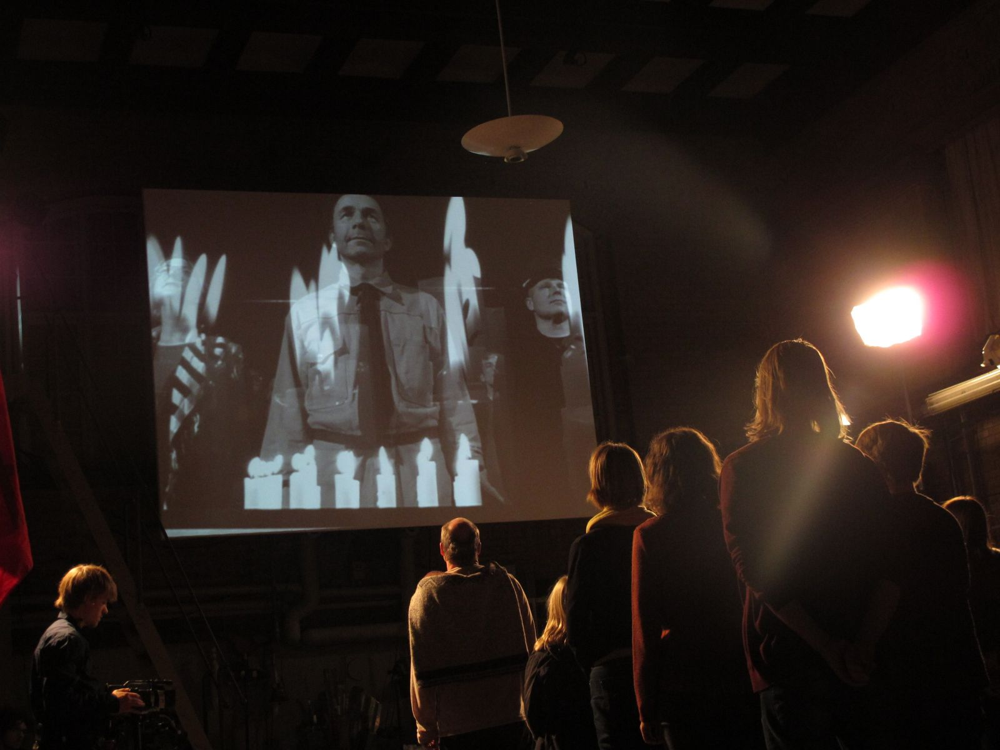
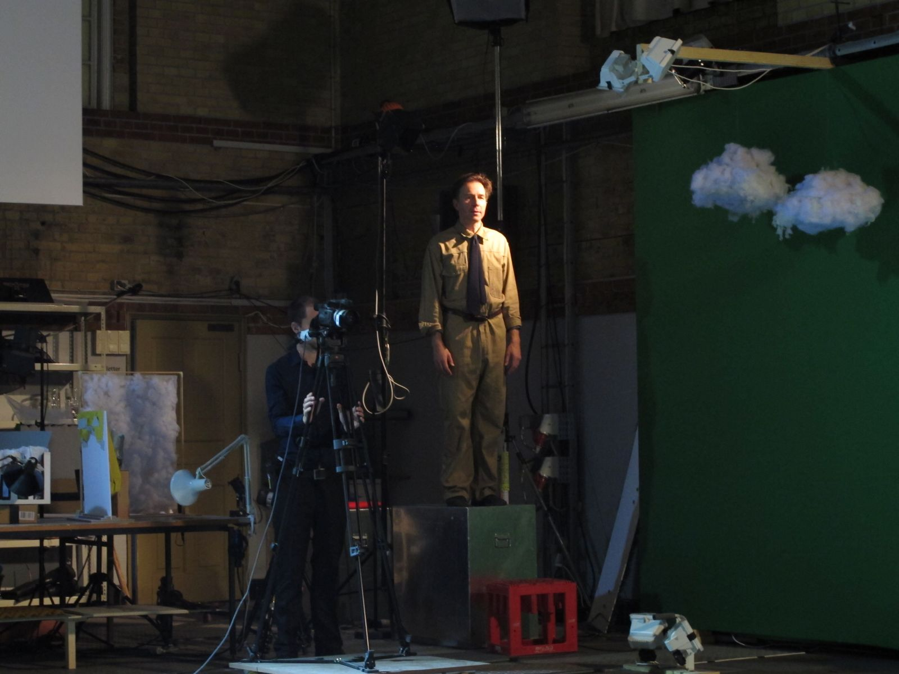

import Vimeo from "../../components/vimeo.js";

export const metadata = {
  date: "2012-11-29",
  title: "Triumph of the Will",
  client: "Fix&Foxy",
  category: "theatre",
};

<Vimeo videoId="91702340" />

_”Art and politics are separate entities and what I did was in the world of art.”_

_Leni Riefenstahl_

In ”Triumph of the Will” we attempted to recreate one of the greatest yet most problematic masterpieces of cinematic history: Leni Riefenstahl's Nazi propaganda film Triumph of the Will. As a gifted, avantgarde woman Riefenstahl happened to ruin art's relationship with beauty. With her poetically filmed and brilliantly edited movie she turned art's relationship with optimism and community rotten.

With large amounts of models and planned shoots, we recreated the film scene by scene, using the audience as props, and letting them watch the movie live on the big screen.

